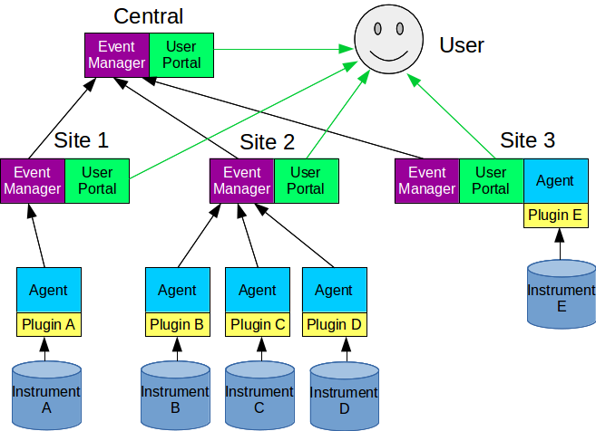

Design
======

WARNO uses a Vagrant VM (Virtual Machine) to create a uniform environment regardless of what OS it is on, and within that VM
starts and manages multiple Docker containers, each of them providing their own service to the other containers
or to the user.

Current services include:

- Agent: Gathers, processes, and passes information to the Event Manager (localhost or remote)

- Event Manager: Gathers data passed from multiple agents and either passes it to a more comprehensive Event Manager or stores it in database.

- User Portal:  Web server allowing users to either visit the web site to access data or to pull out data through a set of API hooks.

- Postgresql:  A database server.

- Data Store:  The physical location for database files, configuration, tool installations, and more to be shared between containers.

- Proxy:  An NGINX proxy server responsible for determining whether requests should be passed to the User Portal or the Event Manager running within the same VM.

WARNO is designed as such that each VM uses the exact same code base, and the difference in roles and functionality is
specified by configuration.  For example, an Agent would likely have the Event Manager disabled on the same VM, and the
destination set for its messages to be passed along to a site Event Manager.  This site Event Manager would have no need
for an Agent to be running, seeing as it is not directly pulling data from an instrument but instead gathering the data
from Agents.

It is however possible to set the destination for an Agent to be an Event Manager on the same VM, for when
it is beneficial to have both on the same server.  In this case, internally the Agent would communicate with this local
Event Manager, and then it would attempt to connect to the configured destination for the central Event Manager.

Another service on the same VM is a User Portal.  This is a running web server that has access to the information that
the Event Manager has been saving on the VM.  This allows someone to either see the information for all instruments that
communicate with that Event Manager, or if they connect to the central User Portal, to see the information for all
instruments.  If a user were to make changes at a site, for example submitting a log for one of the instruments, the log
is then transferred to the central Event Manager for any user to access.

   Figure: Example WARNO network. Each rectangle represents a copy of the WARNO VM, with the only differences being
   configuration and the plugins supplied.  Different configurations determine whether Agent, User Portal,
   and Event Manager are run. Arrows represent data flow.

The User Portal will also include API hooks that will allow other programs (not just browsers) to grab information from
WARNO.